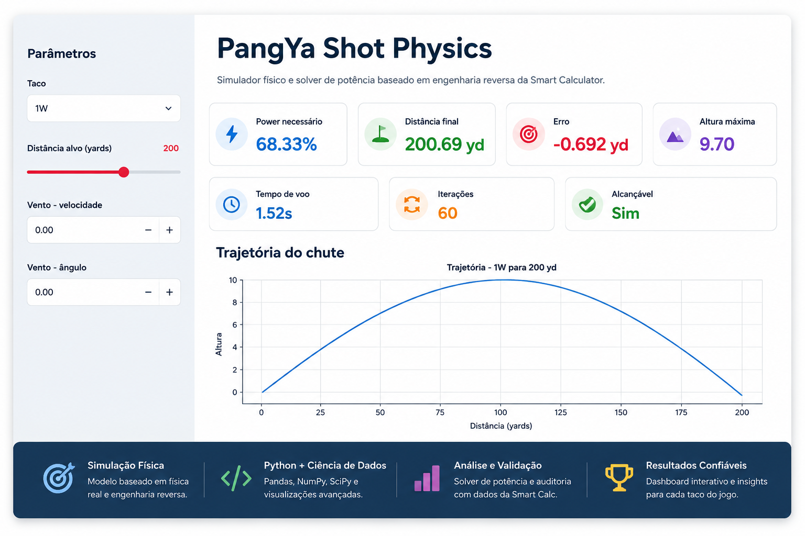
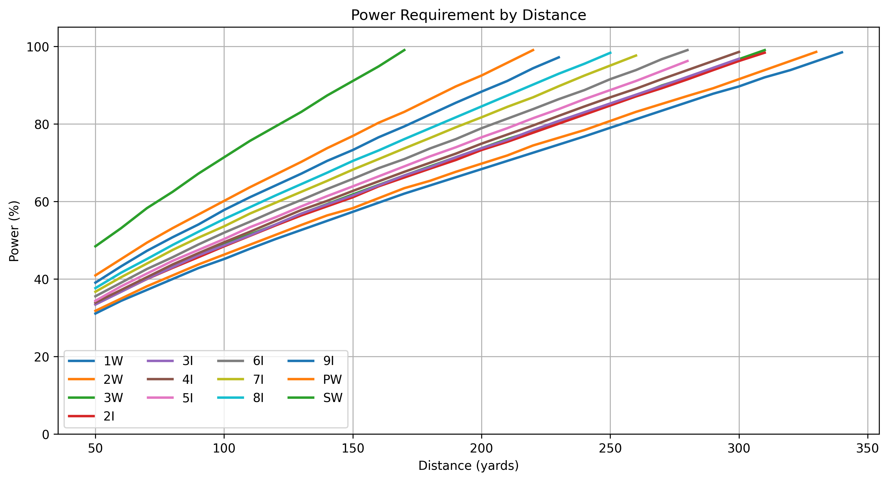
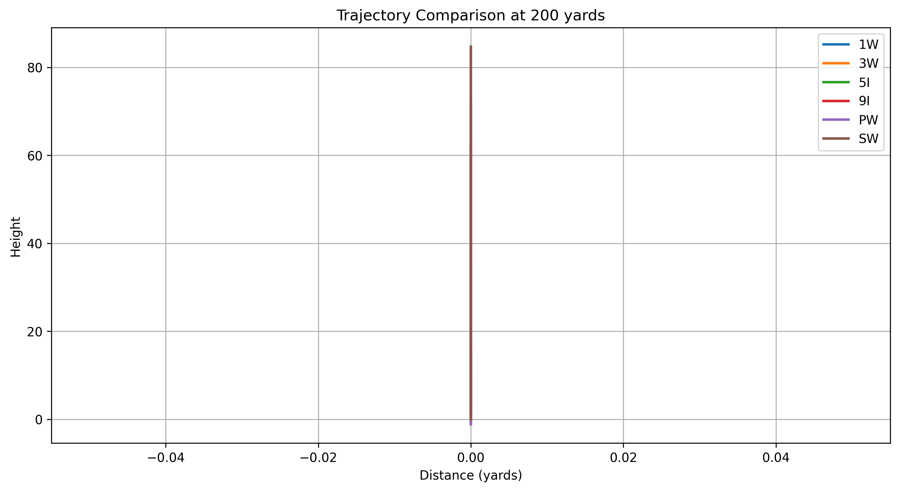
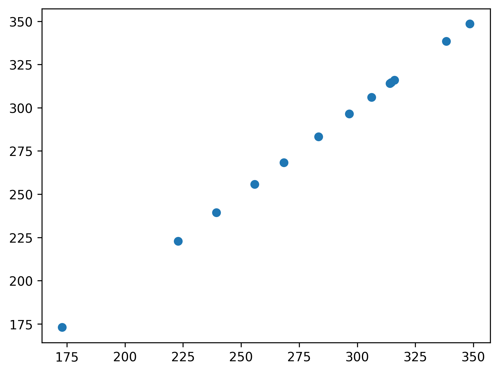

# PangYa Shot Physics

Simulador físico, solver de potência e plataforma de análise de dados inspirados na Smart Calculator de PangYa.

O projeto nasceu como um exercício de engenharia reversa para compreender como o jogo modela trajetórias, potência e comportamento dos diferentes tacos. Ao longo do desenvolvimento, a iniciativa evoluiu para um estudo completo envolvendo simulação física, algoritmos iterativos, testes automatizados, visualização de dados e dashboards interativos.

---

## Dashboard



Dashboard desenvolvido em Streamlit para cálculo automático de potência e visualização de trajetórias.

---

## O Problema

Durante muitos anos a comunidade de PangYa utilizou ferramentas como a Smart Calculator para determinar a potência necessária para cada tacada.

Apesar de extremamente populares, essas ferramentas funcionavam como caixas pretas: os jogadores utilizavam os resultados sem compreender exatamente os mecanismos por trás dos cálculos.

Este projeto busca responder uma pergunta simples:

> Como podemos reproduzir esse comportamento utilizando Python e princípios básicos de física?

---

## Objetivos

* Estudar o funcionamento da Smart Calculator.
* Construir um simulador físico independente.
* Implementar um solver automático de potência.
* Validar resultados contra referências conhecidas.
* Criar análises exploratórias dos tacos.
* Desenvolver visualizações e dashboards interativos.
* Documentar todo o processo de engenharia reversa.

---

## Principais Resultados

### Simulação Física

O simulador calcula:

* distância final;
* altura máxima;
* tempo de voo;
* trajetória completa da bola;
* influência do vento.

### Solver de Potência

Implementação de um algoritmo de busca binária capaz de encontrar automaticamente a potência necessária para atingir uma distância alvo.

### Testes Automatizados

```text
17 testes executados
17 testes aprovados
0 falhas
```

### Notebooks de Análise

```text
22 notebooks
```

Explorando:

* auditoria da Smart Calculator;
* comportamento dos tacos;
* comparação de trajetórias;
* validação do solver;
* análises de sensibilidade.

---

## Visualizações

### Potência Necessária por Distância



Análise da relação entre distância alvo e potência calculada pelo solver.

---

### Comparação de Trajetórias



Comparação visual de trajetórias para diferentes configurações.

---

### Validação da Smart Calculator



Comparação dos resultados produzidos pelo simulador com os valores utilizados como referência durante o processo de auditoria.

---

## Estrutura do Projeto

```text
pangya-shot-physics/

├── src/
│   └── pangya_physics/
│       ├── ball.py
│       ├── club.py
│       ├── wind.py
│       ├── simulator.py
│       ├── solver.py
│       └── distance.py
│
├── tests/
│
├── notebooks/
│
├── data/
│
├── docs/
│
└── app.py
```

---

## Tecnologias Utilizadas

### Linguagem

* Python

### Análise de Dados

* Pandas
* NumPy

### Visualização

* Matplotlib
* Plotly

### Dashboard

* Streamlit

### Testes

* Pytest

### Ambiente

* Jupyter Notebook
* VS Code
* Git
* GitHub

---

## Como Executar

### Clonar o repositório

```bash
git clone https://github.com/felipeallage/pangya-shot-physics.git

cd pangya-shot-physics
```

### Criar ambiente virtual

```bash
python -m venv .venv
```

### Instalar dependências

```bash
pip install -r requirements.txt
```

### Executar testes

```bash
pytest
```

### Executar dashboard

```bash
streamlit run app.py
```

---

## Documentação

Documentação complementar disponível em:

```text
docs/methodology.md
docs/results.md
docs/limitations.md
docs/how_to_run.md
```

---

## Limitações

Este projeto não pretende reproduzir perfeitamente todos os mecanismos internos do PangYa.

Algumas diferenças ainda existem entre os resultados simulados e o comportamento observado no jogo.

As principais limitações conhecidas estão documentadas em:

```text
docs/limitations.md
```

---

## Aprendizados

Este projeto permitiu aplicar conceitos de:

* Engenharia reversa
* Simulação física
* Algoritmos iterativos
* Testes automatizados
* Ciência de dados
* Visualização de dados
* Desenvolvimento de dashboards

Mais do que reproduzir uma calculadora de jogo, este projeto serviu como um estudo completo de modelagem matemática e análise de dados utilizando Python.

---

## Autor

**Felipe Allage**

Administrador | Data Analytics | Python | SQL | Visualização de Dados

GitHub:
https://github.com/felipeallage

LinkedIn:
https://www.linkedin.com/in/felipeallage
